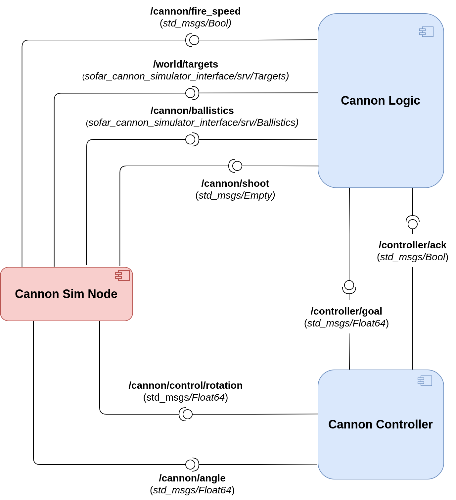

# sofar-cannon-simulator
Final exam for the SOFAR 2023 course - September Session. The goal is to control a cannon robot whose task is to autonomously aim and shoot three static targets. Implementation is done via ROS2/Python with the help of the Arcade library.

## Dependencies

The project targets ROS2 distributions. It has been successfully tested with Galactic and Humble distros (desktop installation).

The only external depencency needed is Arcade library (see [Instructions for Linux install](https://api.arcade.academy/en/latest/install/linux.html))

## Execution

Clone the repository in your workspace and compile as usual.

Run the simulation node with the command:

```ros2 run sofar_cannon_simulator cannon_sim_node```

## Assignment

According to which portion of the exam you need to take, you can focus on specific parts of the assignment:
- If you're taking the full exam, read further, as you will need to implement the full architecture, made up of three nodes.
- If you're taking the pub/sub part only (Part #2), focus on point 2) for the development of the controller.
- If you're taking the client/service part only (Part #3), focus on part 3) for the implementation of the cannon logic + you will need to implement the two service interfaces (only the .srv file, the callbacks are already implemented inside *cannon_sim_node.py*). To this extent, make sure to analyze the commented code in *cannon_sim_node.py* to correctly define the service interfaces. Of course, feel free to de-comment the code once you have provided the interfaces to test your solution.

1) The **cannon sim node** is already provided with this repository and acts as the simulator of the cannon robot, exposing all the necessary interfaces. Specifically, the cannon robot is tasked with aiming and shooting at the three static target.
    1. *Subscribed Topics*
       1) **/cannon/control/rotation**: *Float64* message used to control the orientation of the cannon. 
       2) **/cannon/fire_speed**: *Bool* message used to change the firing speed of the cannonballs. Specifically, set the value to *True* to increase the speed by a fixed amount and *False* to decrease it. The firing speed is not directly controllable by the used and is strictly related to the computation of the ballistics to find out whether the target is reachable or not (read further below).
       3) **/cannon/shoot**: *Empty* message used to signal the cannon to fire a new cannonball, with the current orientation and firing speed.
    2. *Published Topic*
       1) **/cannon/angle**: *Float64* message representing the current angular position of the cannon (in radians). Used for control purposed.
    3. *Exposed Services*
       1) **/world/targets**: allows for retrieving the locations of the targets.
       2) **/cannon/ballistics**: allows for computing the ballistics given a input target to hit. Specifically, the service computes the desired shooting angle for the cannon, making sure that the projectile will hit the specified target. If the target is reachable (with the current firing speed), the service returns the corresponding angle for the cannon (in the interval [0, pi/2]). Conversely, if the target is not reachable with any angular configuration, the service return -1.

2) The **controller node**, which controls the cannon's angular attittude through PID as usual. The cannon's angular attitude is *controlled in velocity*, as the simulation maintains the real value of the angle. Upon reaching a given angular setpoint, the node publishes an *ack* message to the **cannon logic node**.

3) The **cannon logic node**, which acts as *high-level controller*, driving the cannon's routine to automatically aim and shoot at the targets. Specifically, the node first queries the simulation through **/world/targets** service to retrieve the locations of the three targets. The node's routine then proceeds to invoke the **/cannon/ballistics** service to find out, for each target, the corresponding angular position that it needs to achieve. You need to handle three distinct cases:
   1. The ballistics service returns a negative value, indicating that the target is currently unreachable, due to too low firing power. In this case you need to increase the firing speed of the cannonballs and retry.
   2. The ballistics service returns a value in [0, 0.5]. In this case, the target is indeed reachable, but the parabolic trajectory is too stretched (too horizontal), indicating that the firing speed is too high. Reduce the firing speed and recompute.
   3. The ballistics service return a positive value > 0.5. This is the optimal scenario. In this case, the logic will notify the controller to reach the corresponding angular attitude and will then **fire the cannon** to hit the target.
Repeat the above steps until all three targets are hit.
Since we're implementing a simplified version, which does not make use of action servers, you may need to add the following code inside you *main* function:

```
logic = CannonLogic()
    
# Spinning thread to make sure callbacks are executed
spin_thread = Thread(target=rclpy.spin, args=(logic,))
spin_thread.start()
```



### Important Notes

**BEWARE: It is mandatory to launch the full simulation using a launch file. SUBMISSIONS NOT INCLUDING A LAUNCH FILE WILL NOT BE EVALUATED!!!**

**SINCE THERE WERE PROBLEMS WITH RENAMING LAST SESSION, THIS TIME IT WON'T BE NECESSARY TO RENAME THE PACKAGES**

**IT IS MANDATORY, HOWEVER, TO INDICATE WHICH PART OF THE EXAM YOU'RE TAKING BY ADDING A TXT FILE INSIDE YOUR SUBMISSION**

Good luck ;)

## Expected Output


